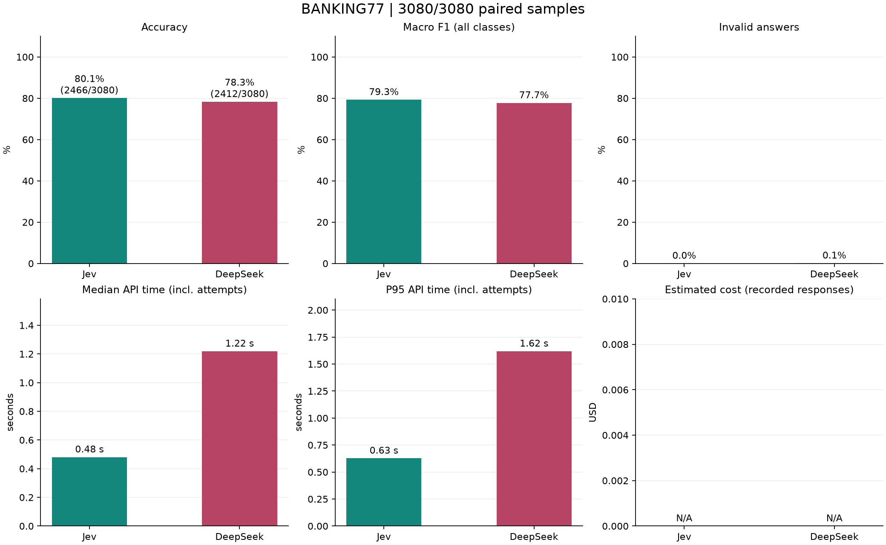

# BANKING77: Jev vs. DeepSeek V4 Pro

A reproducible zero-shot intent-classification benchmark comparing Jev with
DeepSeek V4 Pro on the [BANKING77](https://huggingface.co/datasets/PolyAI/banking77)
test set.

Both models receive the same customer message and the same 77 intent labels.
Ground-truth labels are used only for evaluation and are never sent to either
API. DeepSeek runs with thinking disabled, `temperature=0`, and JSON output.
Invalid or truncated responses count as incorrect predictions.

## Full Test Results

The full test completed successfully with **3,080/3,080 paired records** and
**6,160 total API calls**.

| Model | Accuracy | Macro F1 | Median latency | P95 latency |
| --- | ---: | ---: | ---: | ---: |
| **Jev** | **80.1% (2466/3080)** | **79.3%** | **0.48 s** | **0.63 s** |
| DeepSeek V4 Pro | 78.3% (2412/3080) | 77.7% | 1.22 s | 1.62 s |

Jev made 54 more correct predictions. It leads by 1.75 percentage points in
accuracy and 1.52 percentage points in macro F1. Its median response time was
approximately 2.5x faster. Jev produced no invalid responses; DeepSeek
produced 3.

### Matched-Pair Analysis

| Outcome | Count |
| --- | ---: |
| Both correct | 2,295 |
| **Jev correct, DeepSeek incorrect** | **171** |
| **Jev incorrect, DeepSeek correct** | **117** |
| Both incorrect | 497 |

The exact two-sided McNemar p-value is **0.001742**, indicating that Jev's
advantage on these paired records is statistically significant.

Jev returned a confidence/probability value, so calibration metrics were also
calculated: **ECE = 0.0800** and **multiclass Brier score = 0.3077**. The most
populated confidence bucket was **0.9-1.0**, with a mean confidence of
**0.9829** and an empirical accuracy of **0.9256**.

The chart below includes accuracy, macro F1, invalid-response rate, median and
P95 API latency, and estimated cost when pricing parameters are supplied.



Additional artifacts are available in [`results/full-test`](results/full-test):

- `summary.json`: aggregate and per-class metrics
- `jev.jsonl` and `deepseek.jsonl`: per-record predictions and timings
- `comparison.png` and `comparison.svg`: overall comparison charts
- `per_class_f1.png` and `per_class_f1.svg`: F1 for all 77 intents
- `comparison.json`: models, prompts, selected indices, and run configuration

## Setup

Python 3.10+ and macOS or Linux are supported.

```bash
python3 -m venv .venv
source .venv/bin/activate
python -m pip install -r requirements.txt
```

Create a `.env` file in the project root. Use the variables matching your
providers:

```dotenv
# Independent Jev AI service used for the published benchmark
JEV_AI_KEY=your_jev_ai_key

# DeepSeek
DEEPSEEK_KEY=your_deepseek_key
```

`JEV_AI_KEY` selects the TypeSafe-compatible endpoint at
`https://jev-ai.pro/api/v1/systemone`. For direct TypeSafe access, use
`TYPESAFE_API_KEY` or `JEV_API_KEY`; the official endpoint is selected
automatically. `DEEPSEEK_API_KEY` is also accepted as an alias for
`DEEPSEEK_KEY`.

Shell environment variables take precedence over `.env`. Keys are excluded
from Git by `.gitignore` and are never written to result files.

## Run the Benchmark

Run a balanced pilot with two randomly selected examples from each of the 77
classes. The default seed is 42, so the 154-record selection is reproducible.

```bash
python compare.py --pilot
```

Run the complete 3,080-record test split:

```bash
python compare.py
```

Preview the selection without making paid API calls:

```bash
python compare.py --pilot --dry-run
python compare.py --dry-run
```

Pilot and full-test outputs are isolated from each other:

- Pilot: `results/pilot/`
- Full test: `results/full-test/`

Every successful response is flushed to disk immediately. Rerunning the same
command skips completed provider-record pairs, so interrupted runs resume from
their checkpoints. A file lock prevents concurrent processes from writing to
the same output directory.

## Request Pacing

The default client-side batch settings are:

```bash
python compare.py \
  --concurrency 3 \
  --batch-size 20 \
  --delay 0.3 \
  --batch-delay 2
```

Each text remains a separate API request. Up to three examples per provider
are processed concurrently, with a short delay between groups and an
additional pause after each 20 completed requests. Use `--concurrency 1` for
strictly sequential execution.

HTTP 408, 429, 5xx, and network failures use bounded exponential backoff with
jitter and honor `Retry-After`. Authentication, credit, and request-validation
errors stop the run without discarding completed records.

## Cost Reporting

Token usage is always recorded. Estimated cost remains `N/A` unless rates are
provided explicitly in USD per one million tokens:

```bash
python compare.py --pilot \
  --jev-input-price 0.427 \
  --deepseek-input-price 0.66 \
  --deepseek-cached-price 0.022 \
  --deepseek-output-price 1.98
```

Use the current rates from your own provider account. The program does not
automatically update prices or switch between peak and off-peak rates.
DeepSeek cache-hit, cache-miss, and output tokens are calculated separately.
Estimates cover recorded responses and may not include requests whose responses
were lost after processing.

The completed full test recorded:

- Jev: 5,262,567 input tokens and 2,551,062 output tokens
- DeepSeek: 3,266,698 input tokens and 30,709 output tokens

Jev output tokens are free under the Jev AI plan used for this run.

## Regenerate Charts

Charts can be rebuilt from saved predictions without making API calls:

```bash
python plot_comparison.py results/pilot
python plot_comparison.py results/full-test
```

Accuracy bars show both the percentage and the `correct/total` ratio. The
per-class chart prints each F1 percentage next to its bar and includes overall
accuracy and macro F1 below the chart. Partial runs are marked `INCOMPLETE`,
and charts compare only records completed by both models.

## Jev-Only Runner

The original Jev-only workflow remains available:

```bash
python banking77_jev.py --dry-run --limit 5
python banking77_jev.py --limit 20
python banking77_jev.py
```

## Tests

```bash
python -m unittest discover -s tests -v
```

## Data and Reproducibility

The legacy Python loader in the Hugging Face BANKING77 repository is not
supported by modern `datasets` releases. This project downloads the original
PolyAI CSV files referenced by that loader. Use `--revision` with a commit SHA
from `PolyAI-LDN/task-specific-datasets` to pin the source data.

Model aliases such as `jev-latest` may change over time. Returned model names,
dataset fingerprints, prompts, selected indices, and configuration are stored
with every run.

## References

- [BANKING77 dataset](https://huggingface.co/datasets/PolyAI/banking77)
- [TypeSafe API reference](https://docs.typesafe.ai/api)
- [Jev AI API](https://jev-ai.pro/jev-api)
- [DeepSeek thinking mode](https://api-docs.deepseek.com/guides/thinking_mode/)
- [DeepSeek models and pricing](https://api-docs.deepseek.com/quick_start/pricing/)
